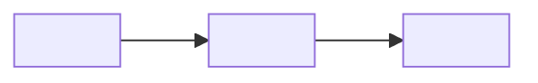
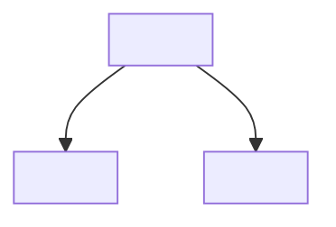
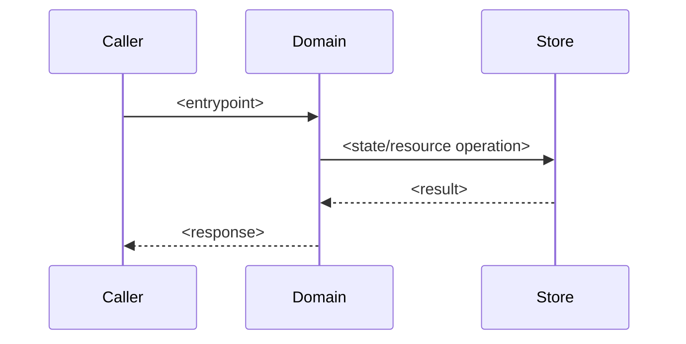

# <domain>

<!-- 模板实例化说明：写入渲染后的 SSOT 文件前，必须把标题、表格标签、占位符和辅助说明翻译为 Phase 0 或 STATUS.md 锁定的 documentation_language。代码标识符、路径、命令、API 名、枚举值和直接引用保持原文。 -->

> 架构 domain README。用于 `architecture/domains/<domain>/README.md`，或兼容的 legacy direct child domain。Domain 负责状态/资源、契约、不变量、失败/恢复和验证证据。
>
> 本文件正文采用 Readable Authority / 可读权威正文：重要小节先给一句到一段的结论性叙述，再用表格记录 owner、evidence、why、风险和约束。Reader Map 只做入口导航，不承载独立长期事实。

## 边界

- **包含**：
- **不包含**：
- **主要证据**：

## 设计意图

用 1-3 段解释为什么这个 domain 作为设计边界存在。说明它要解决的问题、支持哪条系统原则或旅程，以及如果把它并入其他区域会导致什么变得不安全或不清晰。

## 设计约束

| 约束 | 为什么存在 | 违反后果 | 证据 / 来源 |
|---|---|---|---|
| | | | |

## 取舍 / 被拒绝的简化

| 取舍或被拒绝的捷径 | 为什么有诱惑 | 为什么拒绝 / 限定边界 | 证据 / 决策 |
|---|---|---|---|
| | | | |

## 未来 Agent 必须保持的内容

- `<preservation rule>`:

## decomposition_basis

- **选择的拆分轴**: `single-level` / `<runtime boundary | capability boundary | technical subsystem | state lifecycle | critical flow | external contract | change boundary | other>`
- **为什么选择此轴**:
- **被拒绝的拆分轴**:
  - `<axis>`:
  - `<axis>`:
- **递归规则**:
- **覆盖深度**: `deep` / `sampled` / `inferred` / `unknown`
- **覆盖范围**:
- **证据摘要**:
- **图清单**:
- **如果是 single-level**: 说明为什么当前不需要 child domains，以及什么信号会触发递归拆分。
- **停止审查**: `<reviewer>` 对 `single-level` / 停止递归 / 当前 child-domain 深度返回 `no-more-required-changes` / `needs-fix`。
- **Reviewer 挑战**: 摘要最强的被拒绝拆分/递归质疑，以及仍需修改项（如有）。

## 设计单元

| 单元 | 职责 | Owner / 权威来源 | 备注 | 证据 |
|---|---|---|---|---|
| | | | | |

## Domain 一眼看懂 / Reader Map

> Domain 内部入口地图。主题必须来自架构语义、读者问题和仓库证据，不按源码目录机械组织。每行必须指向本 README 的权威小节、child domain 或相关工程区域。

| 子主题 | 读者问题 | 一句话答案 | 权威位置 | Evidence links | Why / 风险 / 约束 |
|---|---|---|---|---|---|
| Runtime flows | 这个 domain 如何处理关键路径？ | | [运行流](#运行流) | | |
| State / resources | 谁拥有写入权和生命周期？ | | [状态、数据与资源](#状态数据与资源) | | |
| Contracts | 哪些边界不能破坏？ | | [跨边界契约](#跨边界契约) | | |
| Failure / recovery | 失败如何检测和恢复？ | | [失败与恢复](#失败与恢复) | | |

## 关键断言与证据

> 使用 SSOT 原生 claim-to-evidence 写法，并记录 why、风险、约束和 owner。完整细节仍留在对应权威小节。证据不足时写 `gap` / `unknown`，不要用空泛总结填充。

| Claim | Why / 风险 / 约束 | Owner / 小节 | Evidence links | 状态 |
|---|---|---|---|---|
| | | | code / config / schema / test / runtime / source material | verified / documented / inferred / unknown |

## 架构视角 / 图

> 本 README 中的 Mermaid 代码块是权威内容。导出的图片只是派生产物。Current 与 Target 图必须分开。Current 图需要代码/配置/schema/test 证据；Target 图需要 decision、ADR、issue 或 conversation 证据。每条 运行流 行都必须链接到 current flow Diagram ID。

### 图索引

| Diagram ID | 状态 | 覆盖内容 | 证据 |
|---|---|---|---|
| `<DOMAIN-CTX-CURRENT>` | current / target / stale | boundary/context | |
| `<DOMAIN-FLOW-...-CURRENT>` | current / target / stale | Runtime flow: `<flow name>` | |

### 外部图候选

> 外部生成图、截图、IDE 依赖图和自动 dependency graph 只能作为候选。吸收时重写为可维护 Mermaid，并补齐 authoritative diagram 的 `Status: current / target / stale`、证据和链接的表格行。

| 候选图来源 | 建议权威 Diagram ID | 覆盖内容 | 需验证内容 | 候选状态 |
|---|---|---|---|---|
| | | | | pending / converted / rejected / obsolete |

### 当前边界 / 上下文

- **Diagram ID**: `<DOMAIN-CTX-CURRENT>`
- **状态**: `current`
- **覆盖内容**: 边界、外部 actor、外部系统，以及适用时的 trust/config 边。
- **证据**:

### 当前分解 / Domain

> 存在 child domains 时必填。若该 domain 保持 single-level，写 `not_applicable`，并附停止理由和匹配的 停止审查证据。覆盖 decomposition/domain。

- **Diagram ID**: `<DOMAIN-DECOMP-CURRENT>`
- **状态**: `current`
- **覆盖内容**: Child domains 和 ownership/dependency 边。
- **证据**:

### 当前运行流图

> 为 `运行流` 的每一行提供一张 current Mermaid 图。复杂 flows 需要总览图加阶段/子流图。当一个 flow 跨架构边界、改变共享/持久状态、拥有资源生命周期、暴露用户/ops/API 行为、涉及锁/事务/重试/回滚、影响安全/信任，或算法密集且高风险时，应记录在这里。

- **Diagram ID**: `<DOMAIN-FLOW-...-CURRENT>`
- **状态**: `current`
- **覆盖内容**: Runtime flow `<flow name>`。
- **证据**:

### 条件性 Current 图

> 当 state/resource ownership、lifecycle/concurrency/scheduling、failure/recovery 或 trust/config 具有独立架构语义时，添加 Mermaid 图。每类图使用独立 Diagram ID 和证据。

### Target 图

> 只有 目标设计 与 current 不同时才添加。不要在同一张图中混合 current 与 target 事实。

## 运行流

| Flow | Diagram ID | 路径 | 纳入原因 | 状态 / 资源所有权 | 证据 |
|---|---|---|---|---|---|
| | `<DOMAIN-FLOW-...-CURRENT>` | | boundary / state / resource / user-ops-api / lock-transaction-retry-rollback / trust / dense-risk | | |

## 状态、数据与资源

| 状态 / 数据 / 资源 | Diagram ID | Owner | 读取者 / 派生使用者 | 持久性 / 生命周期 | 证据 |
|---|---|---|---|---|---|
| | | | | | |

## 配置 / 可变性模型

> 如果没有 env、feature flag、runtime mode、平台差异或部署差异影响此 architecture domain，写 `not_applicable` 并说明原因。

| 可变性来源 | Diagram ID | 模式 / 值 | Owner / 权威来源 | 架构影响 | 证据 |
|---|---|---|---|---|---|
| | | | | | |

## 生命周期 / 并发 / 调度模型

> 如果没有 process/thread/worker/async job/lock/queue/init/shutdown ordering 影响此 architecture domain，写 `not_applicable` 并说明原因。

| 生命周期 / scheduler | Diagram ID | Owner | 顺序 / 并发规则 | 失败 / shutdown 行为 | 证据 |
|---|---|---|---|---|---|
| | | | | | |

## 跨边界契约

| 契约 | Diagram ID | 边界 | 权威来源 | 兼容性规则 | 证据 |
|---|---|---|---|---|---|
| | | | | | |

## 不变量与约束

| 不变量 / 约束 | Diagram ID | 范围 | 违反后果 | 证据 |
|---|---|---|---|---|
| | | | | |

## 失败与恢复

| 失败模式 | Diagram ID | 检测 | 恢复 / 降级 / 终止 | 证据 |
|---|---|---|---|---|
| | | | | |

## 验证

| Claim | 验证命令 / 来源 | 证据指针 | 频率 / 触发条件 |
|---|---|---|---|
| | | | |

## 当前 / 目标 / 差距

> 保持已实现事实和目标设计分离。Current claims 需要代码/配置/schema/test 证据；target claims 需要 decision、ADR、issue 或 conversation 证据。

| 区域 | Current | Target | Gap / 下一步验证 | 证据 / 来源 |
|---|---|---|---|---|
| | | | | |

## 演进 / 迁移台账

> 条件性必填。如果 git history、ADR、docs、源资料 或当前代码显示重大架构迁移、旧 surface 删除、兼容路径、deprecated concept 或“不要复活”概念，在这里记录。否则写 `not_applicable` 并说明原因。这里不是项目 changelog；只包含影响 Current / Target / Gap 的演进。

| 演进线 | 旧形态 | Current / target 替代方案 | 兼容状态 | 不要复活的概念 | 对 Current / Target / Gap 的影响 | 证据 / 决策 |
|---|---|---|---|---|---|---|
| | | | active / deprecated / removed / not_applicable | | | |

## 子 Domains

> 如果该 domain 保持 single-level，写 `No child domains`、停止理由和 reviewer challenge 结果。

| Domain | Diagram ID | 路径 | 为什么独立 | 独立性信号 | 覆盖深度 |停止审查| 证据 |
|---|---|---|---|---|---|---|---|
| | | | | | | no-more-required-changes / needs-fix | |
