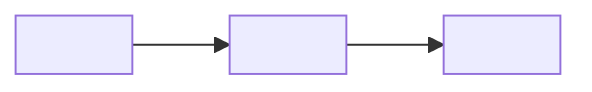
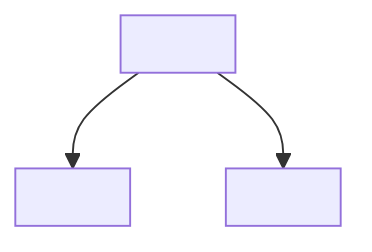

# 架构

<!-- 模板实例化说明：写入渲染后的 SSOT 文件前，必须把标题、表格标签、占位符和辅助说明翻译为 Phase 0 或 STATUS.md 锁定的 documentation_language。代码标识符、路径、命令、API 名、枚举值和直接引用保持原文。 -->

> 架构入口。本文件负责建立系统心智模型，并把读者路由到权威 views/domains。它不是完整审计报告，也不是源码目录清单。
>
> 新 bootstrap 和重大架构重组优先使用 `views/ + domains/`。既有 direct `architecture/<domain>/README.md` 项目保持兼容，不机械迁移。
>
> 开头章节必须用自然语言解释设计意图。表格只是索引和证据台账，不能替代设计思考。
>
> Reader Map、claim-to-evidence、脚本/工具分类和 diagram candidate 治理都是 SSOT 原生能力。本文件必须补上 why、风险、约束和权威 owner，不能退化成自动生成目录镜像。
>
> **Legacy direct child-domain 模式**（无 `architecture/views/`）下，本 README `[MUST]` 额外承担 operating-model 视角的最小职责：`设计简报`、`核心不变量`、`Current / Target / Gap 摘要` 都不能省略，否则设计意图无归宿。详见 `$ssot-preflight` 的 `references/architecture.md` §2.1。

## 设计简报

`[MUST]` 用 1-3 段自然语言回答：这个系统试图让什么成立、服务谁、优化什么，以及未来 Agent 不能破坏什么。具体实现事实要链接证据，但设计立场要放在组件清单之前。不允许只用表格代替叙述。

- **使命 / 承诺**：
- **主要受众 / 操作者**：
- **优化优先级**：
- **当前阶段优先级**：
- **非目标**：
- **成功标准**：
- **未来 Agent 必须保持的内容**：

## 系统原则 / 运行模型

| 字段 | 摘要 | 证据 / 下一步阅读 |
|---|---|---|
| 系统目的 | | |
| 运行哲学 | | |
| 主要 actor / caller | | |
| 不可妥协的设计力量 | | |
| 当前产品 / 运行优先级 | | [views/operating-model.md](./views/operating-model.md) |
| 成功标准 | | [views/critical-journeys.md](./views/critical-journeys.md) |

## 主要用户 / 运行旅程

| 旅程 | 为什么重要 | 权威视角 | 证据 |
|---|---|---|---|
| | | [views/critical-journeys.md](./views/critical-journeys.md) | |

## 架构一眼看懂 / Reader Map

> 入口层地图。主题必须来自 architecture decomposition、读者问题和仓库证据，并按 SSOT 权威位置组织。每行回答读者问题、一句话答案、权威位置、关键证据和主要风险；不要维护独立长期事实，不要只列目录名。

| 主题 | 读者问题 | 一句话答案 | 权威位置 | 关键证据 | 主要风险 / 约束 |
|---|---|---|---|---|---|
| Operating model | mission / actors / priorities / non-goals 如何影响取舍？ | | [views/operating-model.md](./views/operating-model.md) | | |
| Critical journeys | user / runtime / failure journeys 如何闭环？ | | [views/critical-journeys.md](./views/critical-journeys.md) | | |
| Current-target-gap | 当前实现与目标设计差在哪里？ | | [views/current-target-gap.md](./views/current-target-gap.md) | | |
| `<domain topic>` | state / contract / failure / lifecycle 谁负责？ | | [domains/<domain>/README.md](./domains/<domain>/README.md) | | |

## 核心不变量

`[MUST]` legacy 模式下必填；新结构下可链接到 domain 不变量节。每行链接对应 domain README 的「不变量与约束」节，避免在 root 重复维护。

| 不变量 | 范围 | 违反后果 | 权威 domain / 证据 |
|---|---|---|---|
| | | | |

## 视角索引

| 视角 | 路径 | 回答的问题 | 状态 | 证据 |
|---|---|---|---|---|
| 运行模型 | [views/operating-model.md](./views/operating-model.md) | 使命、原则、优先级、非目标、成功标准、主要路径 | gap / covered / stale / unknown | |
| 关键旅程 | [views/critical-journeys.md](./views/critical-journeys.md) | 端到端旅程、业务闭环、生命周期、验收和恢复信号 | gap / covered / stale / unknown | |
| Current / Target / Gap | [views/current-target-gap.md](./views/current-target-gap.md) | 已实现状态、目标设计、迁移立场、设计缺口 | gap / covered / stale / unknown | |

## Domain 索引

> Domain 负责状态/资源、契约、失败/恢复、不变量和验证。新结构使用 `domains/<domain>/README.md`；保留既有 SSOT 时，可链接 legacy direct child domain。

| Domain | 路径 | 为什么独立 | 独立性信号 | 状态 | 证据 |
|---|---|---|---|---|---|
| | [domains/<domain>/README.md](./domains/<domain>/README.md) | | state / resource / contract / failure / invariant / lifecycle / gap / verification | gap / covered / stale / unknown | |

## 当前 / 目标 / 差距 摘要

| 区域 | Current | Target | Gap / 下一步验证 | 权威位置 |
|---|---|---|---|---|
| | | | | [views/current-target-gap.md](./views/current-target-gap.md) |

## 架构视角 / 图

> Mermaid 代码块是权威内容。导出的图片只是派生产物。Root 图应保持总览层级；详细 flow/state/failure 图归入相关 view 或 domain。

### 图索引

| Diagram ID | 状态 | 覆盖内容 | 权威位置 | 证据 |
|---|---|---|---|---|
| `<ARCH-CTX-CURRENT>` | current / target / stale | boundary/context | this file | |
| `<ARCH-DOMAIN-CURRENT>` | current / target / stale | domains/decomposition | this file or [domains/README.md](./domains/README.md) | |

### 外部图候选

> 外部生成图、截图、IDE 依赖图和自动 dependency graph 只作为候选。吸收时必须重写成下面的 Mermaid 权威图，并补齐 authoritative diagram 的 `Status: current / target / stale`、证据和 owner。

| 候选图来源 | 建议权威 Diagram ID | 建议权威位置 | 需验证内容 | 候选状态 |
|---|---|---|---|---|
| | | | | pending / converted / rejected / obsolete |

### 当前边界 / 上下文

- **Diagram ID**: `<ARCH-CTX-CURRENT>`
- **状态**: `current`
- **覆盖内容**: 系统边界、外部 actor/system，以及适用时的 trust/config 边。
- **证据**:

### 当前 Domain 图

> 存在 domains 或 legacy direct child domains 时必填。若为 single-level，写 `not_applicable`，并附 停止审查证据。

- **Diagram ID**: `<ARCH-DOMAIN-CURRENT>`
- **状态**: `current`
- **覆盖内容**: Domain 及 ownership/dependency 边。
- **证据**:

## 关键断言与证据

> Root 层只保留最能改变后续实现决策的断言。每条必须链接 owner；不要把完整代码索引搬进这里。

| Claim | Why / 风险 / 约束 | 权威 owner | Evidence links | 状态 |
|---|---|---|---|---|
| | | view / domain / engineering area / decision | code / config / schema / test / runtime / source material | verified / documented / inferred / unknown |

## decomposition_basis

- **选择的拆分轴**: `views+domains` / `single-level` / `<runtime boundary | capability boundary | technical subsystem | state lifecycle | critical flow | external contract | change boundary | other>`
- **为什么选择此轴**:
- **被拒绝的拆分轴**:
  - `<axis>`:
  - `<axis>`:
- **递归规则**:
- **覆盖深度**: `deep` / `sampled` / `inferred` / `unknown`
- **覆盖范围**:
- **证据摘要**:
- **图清单**:
- **Legacy 兼容性**: `not_applicable` / direct child domains retained at `<path>` because `<reason>`.
- **如果是 single-level**: 说明为什么暂时不需要 domain，以及什么信号会触发递归拆分。
- **停止审查**: `<reviewer>` 对 `single-level` / 停止递归 / 当前 domain 深度返回 `no-more-required-changes` / `needs-fix`。
- **Reviewer 挑战**: 摘要最强的被拒绝拆分/递归质疑，以及仍需修改项（如有）。

## 证据与覆盖

| Claim / 区域 | 覆盖深度 | 证据指针 | Gap / 下一步动作 |
|---|---|---|---|
| Root 心智模型 | deep / sampled / inferred / unknown | | |
| Views | deep / sampled / inferred / unknown | | |
| Domains | deep / sampled / inferred / unknown | | |

## 源资料吸收指针

> 完整吸收矩阵位于 `SSOT/STATUS.md`。本节只把 architecture 相关源资料链接到其权威位置。

| 源资料 | 分类 | 权威位置 | 状态 / 冲突 |
|---|---|---|---|
| | absorb / link-only / stale/conflict / obsolete | | |
