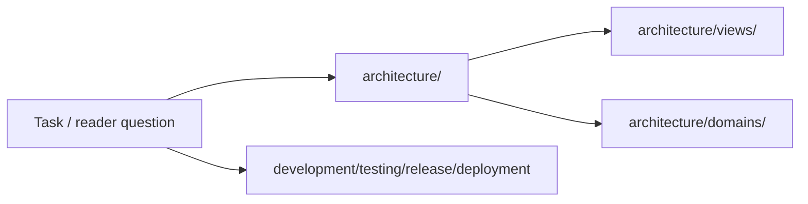

# SSOT

<!-- 模板实例化说明：写入渲染后的 SSOT 文件前，必须把标题、表格标签、占位符和辅助说明翻译为 Phase 0 或 STATUS.md 锁定的 documentation_language。代码标识符、路径、命令、API 名、枚举值和直接引用保持原文。 -->

> 仓库事实的单一事实来源。Agent 任务开始前先读此文件。

## 快速理解地图 / Reader Map

> 入口层地图，帮助读者快速定位权威位置。每行必须指向 SSOT 权威区域；不要在这里维护独立长期事实。只写入口问题、优先读取位置、关键证据方向和风险提示。

| 读者问题 | 优先读取 | 权威位置 | 关键证据方向 | 主要风险 / 约束 |
|---|---|---|---|---|
| 系统如何运行、边界在哪里、哪些约束不能破坏？ | Core | [architecture/](./architecture/README.md) | code / config / schema / tests / source material | |
| 如何本地运行、构建、生成和修改代码？ | Reference | [development/](./development/README.md) | package scripts / Makefile / Dockerfile / tool scripts | |
| 改动后如何验证，哪些测试保护历史问题？ | Reference | [testing/](./testing/README.md) | test configs / CI / fixtures / bug regression links | |
| 版本、发布和交付一致性如何保持？ | Reference | [release/](./release/README.md) / [deployment/](./deployment/README.md) | release scripts / CI / version files | |

### 全局阅读路径图

> 可选。复杂仓库可用 Mermaid 表达第一层阅读路径；小型仓库写 `not_applicable` 和原因。图只做入口路由，不承载独立事实。

## 区域索引

| 区域 | 路径 | 读取层级 | 状态 |
|---|---|---|---|
| 系统架构主干 | [architecture/](./architecture/README.md) | Core | |
| 仓库身份 | [identity/](./identity/README.md) | Reference | |
| 专有名词 | [glossary/](./glossary/README.md) | Reference | |
| 开发工作流 | [development/](./development/README.md) | Reference | |
| 测试策略 | [testing/](./testing/README.md) | Reference | |
| 部署与分发 | [deployment/](./deployment/README.md) | Reference | |
| 发布流程 | [release/](./release/README.md) | Reference | |
| 重大决策 | [decisions/](./decisions/README.md) | Reference | |
| 已知陷阱 | [gotchas/](./gotchas/README.md) | Reference | |
| Bug 修复记录 | [bugs/](./bugs/README.md) | Reference | |
| 技术债务 | [tech-debt/](./tech-debt/README.md) | Reference | |

## 任务入口映射

> 条件性薄索引。只有 git history、commit 审查或长期会话显示高频/高风险研发任务簇时才维护；否则写 `not_applicable`。本表只链接权威位置，不维护独立事实或 playbook 正文。

| 任务簇 | 触发信号 | 优先读取 | 权威位置 | 最终检查 |
|---|---|---|---|---|
| | | | | |

维护状态见 [STATUS.md](./STATUS.md)。
