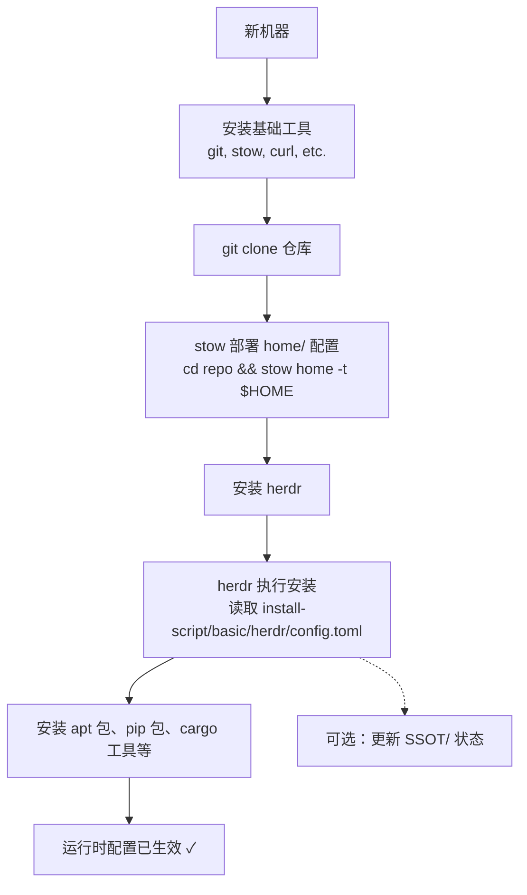

# 架构文档

## 设计哲学

本仓库采用 **三阶段分层架构**，将系统配置管理拆分为三个独立阶段：**状态记录 → 安装执行 → 运行时配置**。每个阶段职责单一，通过明确的契约（文件格式、目录结构）衔接。

---

## 三阶段总览

```
┌──────────────────────────────────────────────────────────────┐
│                        三阶段架构                              │
├──────────────────────────────────────────────────────────────┤
│                                                              │
│  [阶段1] 状态记录 (SSOT/)                                    │
│  ┌─────────────────────────────────────────────────┐         │
│  │  记录系统当前状态（已安装的包、工具版本）          │         │
│  │  用途：新机器重建、差异对比、升级追踪              │         │
│  │  管理：手动维护，不 git 追踪                      │         │
│  └─────────────────────────────────────────────────┘         │
│                           │                                   │
│                           ▼                                   │
│  [阶段2] 安装执行 (herdr + install-script/)                  │
│  ┌─────────────────────────────────────────────────┐         │
│  │  根据 install-script 配置安装工具                 │         │
│  │  编排工具：herdr                                  │         │
│  │  包管理器：apt、pip、cargo、npm 等                 │         │
│  │  管理：git 追踪                                    │         │
│  └─────────────────────────────────────────────────┘         │
│                           │                                   │
│                           ▼                                   │
│  [阶段3] 运行时配置 (home/ → stow → $HOME)                   │
│  ┌─────────────────────────────────────────────────┐         │
│  │  日常使用的最终配置文件                           │         │
│  │  部署工具：GNU stow                              │         │
│  │  管理：git 追踪，版本控制                         │         │
│  └─────────────────────────────────────────────────┘         │
│                                                              │
└──────────────────────────────────────────────────────────────┘
```

---

## 阶段详解

### 阶段1：SSOT（Single Source of Truth）

**目录：** `SSOT/`

系统状态快照，记录"当前系统上有什么"。不参与安装或配置流程，仅作为信息参考。

| 文件 | 内容 | 用途 |
|------|------|------|
| `STATUS.md` | SSOT 覆盖状态与事件源追踪 | 追踪文档覆盖缺口与变更来源 |
| `README.md` | SSOT 区域索引与阅读路径 | 新读者快速了解 SSOT 结构 |

**更新方式：** 手动维护。运行系统更新后，手动更新对应文件。

### 阶段2：安装执行

**目录：** `install-script/`

herdr 的配置源。定义每台机器上需要安装的工具和包。

```
install-script/
└── basic/                          # 基础安装配置
    ├── herdr/
    │   ├── config.toml             # herdr 主配置（核心）
    │   │   ├── 包列表（apt/pip/cargo/npm）
    │   │   ├── 工具定义（安装方式、版本）
    │   │   └── 机器特定配置
    │   └── install-herdr-config.sh # 安装脚本，将 herdr 配置链接到 $HOME
    ├── ...
    └── bash/                       # 基础 bash 配置
```

### 阶段3：运行时配置

**目录：** `home/`

日常使用的最终配置文件。通过 GNU stow 部署到 `$HOME` 目录。

```
home/                          # stow 根目录
├── .bash-aliases              # → ~/.bash-aliases
├── .bash-env                  # → ~/.bash-env
├── .bash-source               # → ~/.bash-source
├── .tmux.conf                 # → ~/.tmux.conf
├── .cargo/
│   └── config.toml            # → ~/.cargo/config.toml
├── .cgdb/
│   └── cgdbrc                 # → ~/.cgdb/cgdbrc
└── .config/
    └── herdr/
        └── config.toml        # → ~/.config/herdr/config.toml
```

**部署方式：**
```bash
cd ~/hpf_Linux_Config
stow home -t $HOME          # 部署所有符号链接
stow -D home -t $HOME       # 撤销所有符号链接
```

**新增配置文件：**
1. 将文件放到 `home/` 下与 `$HOME` 对应的路径
2. `git add` 并提交
3. 重新运行 `stow home -t $HOME`，Stow 自动创建符号链接

**herdr 配置说明：**
- `config.toml` — 通用配置，git 追踪
- `config.local.toml` — 机器特定配置，git 追踪（每台机器内容不同）
- `state.json` — herdr 运行时自动生成的状态，不 git 追踪

---

## 新机器部署流程



---

## 机器间差异管理

不同机器的差异通过 herdr 的 `config.local.toml` 管理：

| 差异类型 | 管理方式 |
|---------|---------|
| 安装的包不同 | herdr config.toml 中按机器分组 |
| 配置内容不同 | herdr config.local.toml 覆盖 |
| 硬件相关配置 | 在各自的 config.local.toml 中定义 |

---

## 未追踪目录说明

以下目录存在于仓库根目录但不 git 追踪：

| 目录 | 用途 | 不追踪原因 |
|------|------|-----------|
| `SSOT/` | 系统状态快照 | 手动维护，不参与安装/配置流程 |
| `home/.config/herdr/state.json` | herdr 运行时状态 | 自动生成，机器相关 |
