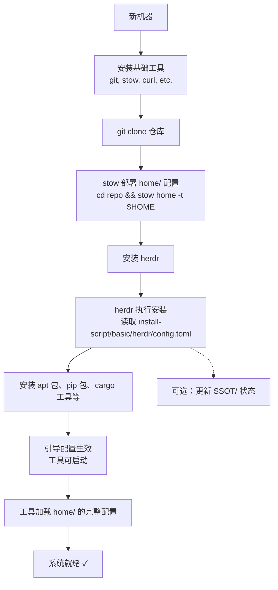

# 架构文档

## 设计哲学

本仓库采用 **三阶段分层架构**，将系统配置管理拆分为三个独立阶段：**状态记录 → 安装执行 → 运行时配置**。每个阶段职责单一，通过明确的契约（文件格式、目录结构）衔接。

---

## 三阶段总览

```
┌──────────────────────────────────────────────────────────────┐
│                        三阶段架构                              │
├──────────────────────────────────────────────────────────────┤
│                                                              │
│  [阶段1] 状态记录 (SSOT/)                                    │
│  ┌─────────────────────────────────────────────────┐         │
│  │  记录系统当前状态（已安装的包、工具版本）          │         │
│  │  用途：新机器重建、差异对比、升级追踪              │         │
│  │  管理：手动维护，不 git 追踪                      │         │
│  └─────────────────────────────────────────────────┘         │
│                           │                                   │
│                           ▼                                   │
│  [阶段2] 安装执行 (herdr + install-script/)                  │
│  ┌─────────────────────────────────────────────────┐         │
│  │  根据 install-script 配置安装工具                 │         │
│  │  编排工具：herdr                                  │         │
│  │  包管理器：apt、pip、cargo、npm 等                 │         │
│  │  管理：git 追踪                                    │         │
│  └─────────────────────────────────────────────────┘         │
│                           │                                   │
│                           ▼                                   │
│  [阶段3] 运行时配置 (home/ → stow → $HOME)                   │
│  ┌─────────────────────────────────────────────────┐         │
│  │  日常使用的最终配置文件                           │         │
│  │  部署工具：GNU stow                              │         │
│  │  管理：git 追踪，版本控制                         │         │
│  └─────────────────────────────────────────────────┘         │
│                                                              │
└──────────────────────────────────────────────────────────────┘
```

---

## 阶段详解

### 阶段1：SSOT（Single Source of Truth）

**目录：** `SSOT/`

系统状态快照，记录"当前系统上有什么"。不参与安装或配置流程，仅作为信息参考。

| 文件 | 内容 | 用途 |
|------|------|------|
| `package_list.json` | 已安装的 apt 包清单（~280+ 包） | 新机器重建时对比差异 |
| `tool_versions.json` | CLI 工具的版本号 | 升级追踪，确认版本一致性 |
| `sisyphus_state.json` | sisyphus 工作流状态 | 工作流断点续传 |

**更新方式：** 手动维护。运行系统更新后，手动更新对应文件。

### 阶段2：安装执行

**目录：** `install-script/`

herdr 的配置源。定义每台机器上需要安装的工具和包。

```
install-script/
└── basic/                          # 基础安装配置
    ├── herdr/
    │   └── config.toml             # herdr 主配置（核心）
    │       ├── 包列表（apt/pip/cargo/npm）
    │       ├── 工具定义（安装方式、版本）
    │       └── 机器特定配置
    ├── nvim/
    │   └── init.lua                # 引导配置（跳板）
    └── zsh/
        └── .zshrc                  # 引导配置（跳板）
```

**关于引导配置：**
`install-script/basic/nvim/init.lua` 和 `install-script/basic/zsh/.zshrc` 是 **新机器初始化时的临时跳板配置**。它们的目的是让工具能在安装阶段先启动起来。安装完成后，`home/` 下的完整配置会通过 stow 部署覆盖它们。

**引导配置 vs 运行时配置：**

| 维度 | 引导配置 (install-script/) | 运行时配置 (home/) |
|------|--------------------------|-------------------|
| 阶段 | 安装时使用 | 日常使用 |
| 复杂度 | 轻量，仅基本设置 | 完整，含插件管理 |
| 覆盖 | 被 home/ 覆盖 | 最终生效版本 |
| 更新 | 几乎不改 | 随需要更新 |

### 阶段3：运行时配置

**目录：** `home/`

日常使用的最终配置文件。通过 GNU stow 部署到 `$HOME` 目录。

```
home/
├── .config/
│   ├── nvim/                    # Neovim（lazy.nvim 插件管理）
│   ├── zsh/                     # Zsh（zinit 插件管理）
│   ├── git/                     # Git 配置
│   ├── tmux/                    # Tmux
│   ├── herdr/                   # herdr 状态配置
│   │   ├── config.toml          #   通用配置
│   │   ├── config.local.toml    #   机器特定覆盖
│   │   └── state.json           #   运行时状态（不 git 追踪）
│   ├── bat/                     # Bat 主题
│   ├── ripgrep/                 # Ripgrep
│   ├── lf/                      # lf 文件管理器
│   ├── btop/                    # btop 系统监控
│   ├── kitty/                   # Kitty 终端
│   └── starship.toml            # Starship 提示符
├── .local/bin/                  # 自定义脚本
├── .zshenv                      # Zsh 环境变量
└── .gitconfig                   # Git 全局配置
```

**部署方式：**
```bash
cd ~/hpf_Linux_Config
stow home -t $HOME
```

**herdr 配置说明：**
- `config.toml` — 通用配置，git 追踪
- `config.local.toml` — 机器特定配置，git 追踪（每台机器内容不同）
- `state.json` — herdr 运行时自动生成的状态，不 git 追踪

---

## 新机器部署流程



---

## 机器间差异管理

不同机器的差异通过 herdr 的 `config.local.toml` 管理：

| 差异类型 | 管理方式 |
|---------|---------|
| 安装的包不同 | herdr config.toml 中按机器分组 |
| 配置内容不同 | herdr config.local.toml 覆盖 |
| 硬件相关配置 | 在各自的 config.local.toml 中定义 |

---

## 未追踪目录说明

以下目录存在于仓库根目录但不 git 追踪：

| 目录 | 用途 | 不追踪原因 |
|------|------|-----------|
| `SSOT/` | 系统状态快照 | 手动维护，不参与安装/配置流程 |
| `.sisyphus/` | 自定义工作流工具 | 独立于配置管理的工具 |
| `.codex/` | AI 辅助工具 | 独立于配置管理的工具 |
| `home/.config/herdr/state.json` | herdr 运行时状态 | 自动生成，机器相关 |
