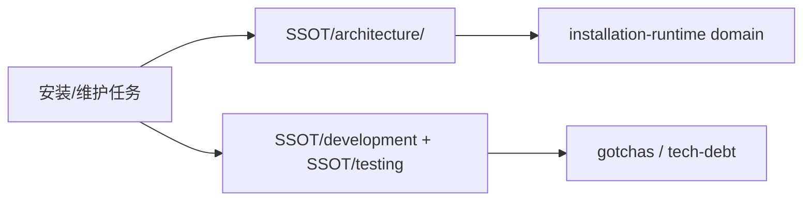

# SSOT

> 本仓库事实的单一事实来源。任何涉及安装环境、检查安装状态、自动化执行安装或调整安装入口的任务，都先从这里进入，再按 reader map 下钻。

## 快速理解地图 / Reader Map

| 读者问题 | 优先读取 | 权威位置 | 关键证据方向 | 主要风险 / 约束 |
|---|---|---|---|---|
| 这个仓库是什么、服务谁、为什么强调 agent-first？ | Core | [architecture/](./architecture/README.md) | README、AGENTS、playbook、runner | 不能跳过 runner 和工具目录约束。 |
| 安装主入口、工具目录和预设组合怎么工作？ | Core | [architecture/domains/installation-runtime/README.md](./architecture/domains/installation-runtime/README.md) | `agent-runner.py`、`agent-tools.json`、`install-script/` 子目录 | 不能把历史脚本当唯一真相，必须先回到 catalog。 |
| 本地如何执行、检查和扩展安装能力？ | Reference | [development/](./development/README.md) | runner 命令、脚本目录、README/playbook | 仓库路径固定为 `~/hpf_Linux_Config`。 |
| 改动后怎么验证有没有破坏安装行为？ | Reference | [testing/](./testing/README.md) | `check_cmd`、runner `check`、脚本自检 | “执行成功但验收失败” 与 “脚本执行失败” 要区分。 |
| 已知陷阱和过渡债务在哪里？ | Reference | [gotchas/](./gotchas/README.md)、[tech-debt/](./tech-debt/README.md) | playbook、研究文档、脚本注释 | Ubuntu 24.04、GitHub 认证路径、Neovim 现代化都是高风险点。 |

### 全局阅读路径图

## 区域索引

| 区域 | 路径 | 读取层级 | 状态 |
|---|---|---|---|
| 系统架构主干 | [architecture/](./architecture/README.md) | Core | active |
| 仓库身份 | [identity/](./identity/README.md) | Reference | active |
| 专有名词 | [glossary/](./glossary/README.md) | Reference | active |
| 开发工作流 | [development/](./development/README.md) | Reference | active |
| 测试策略 | [testing/](./testing/README.md) | Reference | active |
| 部署与分发 | [deployment/](./deployment/README.md) | Reference | active |
| 发布流程 | [release/](./release/README.md) | Reference | active |
| 重大决策 | [decisions/](./decisions/README.md) | Reference | active |
| 已知陷阱 | [gotchas/](./gotchas/README.md) | Reference | active |
| Bug 修复记录 | [bugs/](./bugs/README.md) | Reference | active |
| 技术债务 | [tech-debt/](./tech-debt/README.md) | Reference | active |

## 任务入口映射

| 任务簇 | 触发信号 | 优先读取 | 权威位置 | 最终检查 |
|---|---|---|---|---|
| 安装环境 / 自动化执行安装 | 用户要装一套环境、跑某个 preset、补装工具 | `architecture` → `development` | [installation-runtime domain](./architecture/domains/installation-runtime/README.md)、[development](./development/README.md) | `python3 install-script/agent-runner.py check <tool|all>` |
| 检查安装状态 / 诊断某个工具是否就绪 | 用户问“装好了吗”“为什么 check 失败” | `testing` → `gotchas` | [testing](./testing/README.md)、[gotchas](./gotchas/README.md) | 对应 `check_cmd` |
| 扩展工具目录 / 新增脚本 | 修改 `agent-tools.json`、preset、工具脚本 | `architecture` → `development` → `testing` | [installation-runtime domain](./architecture/domains/installation-runtime/README.md)、[development](./development/README.md)、[testing](./testing/README.md) | `list` + `check` + 新脚本路径验证 |

维护状态见 [STATUS.md](./STATUS.md)。
