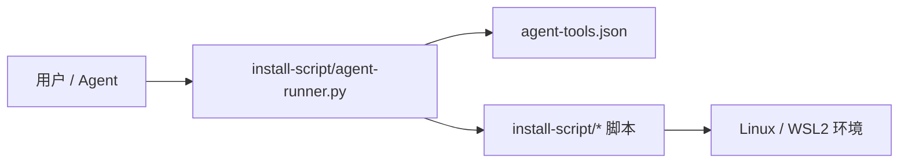
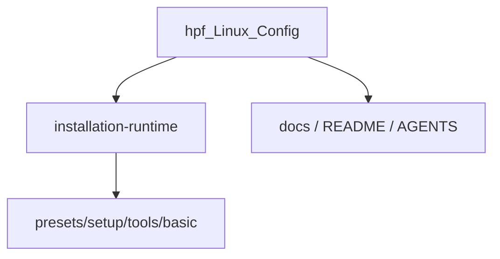

# 架构

> 本仓库不是常驻服务，而是一个面向 Linux / WSL2 开发机初始化的配置与安装仓库。架构主干围绕一个核心命题展开：用固定仓库路径、确定性 runner 和单一工具目录，把“人手点脚本”改成 agent 可以稳定执行、稳定验证的安装系统。
>
> 这里真正的系统边界不在 Web/API，而在 `install-script/` 这套编排约束：上层是任务与操作者，下层是 shell 安装脚本和本机状态，中间由 `agent-runner.py` 与 `agent-tools.json` 维持一致的入口、校验和日志语义。

## 设计简报

- **使命 / 承诺**：为 `~/hpf_Linux_Config` 提供可重复执行的开发环境配置仓库，并让 agent 能先探测、再执行、最后用 `check_cmd` 验证结果。
- **主要受众 / 操作者**：仓库所有者本人，以及代为执行安装/检查任务的 coding agent。
- **优化优先级**：确定性入口、可验证性、固定路径约束、脚本模块化、GitHub 认证边界清晰：`github-auth` 单工具默认 `gh + HTTPS`，个人 `bootstrap` / `all-tools` 在 `hpf` 账户默认 SSH。
- **当前阶段优先级**：以 `install-script/agent-runner.py` 取代自由拼装脚本调用；把 `agent-tools.json` 作为单一 catalog。
- **非目标**：不把仓库包装成通用跨平台安装器；不为 OpenHarmony、个人脚本、旧 no-use 目录提供默认初始化保证。
- **成功标准**：agent 能依据 playbook 找到正确入口，执行 `list/check/install/preset`，并能用 `check_cmd` 区分成功、失败和验收失败。
- **未来 Agent 必须保持的内容**：不要绕过 runner 直接发明流程；不要绕开 `agent-tools.json` 自建工具目录；不要忽略固定仓库路径和 Ubuntu 版本差异。

## 系统原则 / 运行模型

| 字段 | 摘要 | 证据 / 下一步阅读 |
|---|---|---|
| 系统目的 | 把 Linux/WSL2 开发环境配置收束为可执行、可验证的仓库级安装系统。 | [运行模型](./views/operating-model.md) |
| 运行哲学 | 先探测、再提问、后执行、最后验证；入口统一经 `agent-runner.py`。 | [运行模型](./views/operating-model.md) |
| 主要 actor / caller | 用户、agent、`agent-runner.py`、shell 安装脚本、目标机器环境。 | [installation-runtime domain](./domains/installation-runtime/README.md) |
| 不可妥协的设计力量 | 固定路径、单一工具目录、`check_cmd` 为唯一状态来源、GitHub 认证边界清晰。 | [installation-runtime domain](./domains/installation-runtime/README.md) |
| 当前产品 / 运行优先级 | runner-first 安装流和可验证 catalog 已经取代旧 TUI/state 思路。 | [运行模型](./views/operating-model.md) |
| 成功标准 | `list/check/install/preset` 可预测且结果可回读。 | [关键旅程](./views/critical-journeys.md) |

## 主要用户 / 运行旅程

| 旅程 | 为什么重要 | 权威视角 | 证据 |
|---|---|---|---|
| 新机器 bootstrap 到最小工具集 | 这是仓库最核心的价值交付路径。 | [关键旅程](./views/critical-journeys.md) | `README-CN.md`、`docs/agent-install-playbook.md` |
| 对单个工具执行 check/install | 这是日常维护与诊断的最小闭环。 | [关键旅程](./views/critical-journeys.md) | `agent-runner.py list/check/install` |
| 扩展 catalog 或 preset | 这是仓库持续演进的主要变更入口。 | [installation-runtime domain](./domains/installation-runtime/README.md) | `agent-tools.json`、`presets/*.sh` |

## 架构一眼看懂 / Reader Map

| 主题 | 读者问题 | 一句话答案 | 权威位置 | 关键证据 | 主要风险 / 约束 |
|---|---|---|---|---|---|
| Operating model | 为什么这个仓库强调 agent-first 和 deterministic runner？ | 因为安装任务需要稳定入口与稳定验收，而不是临时手敲脚本。 | [views/operating-model.md](./views/operating-model.md) | README、playbook、AGENTS | 自由执行历史脚本会绕开 catalog 与 check 语义。 |
| Critical journeys | 安装与检查的主路径如何闭环？ | 用户/agent 通过 runner 选择 tool/preset，脚本执行后再回到 `check_cmd` 验证。 | [views/critical-journeys.md](./views/critical-journeys.md) | `agent-runner.py`、`agent-tools.json` | 不能把“脚本 exit 0”误当成“环境就绪”。 |
| Current-target-gap | 当前实现已经统一了什么，还缺什么？ | 已有统一入口与 catalog，未形成强约束的 release/decision 体系。 | [views/current-target-gap.md](./views/current-target-gap.md) | SSOT 当前各区域 | 发布治理仍偏轻量。 |
| Installation runtime | 谁负责编排、状态判定、脚本分层和平台差异？ | `install-script/` 及其 runner/catalog domain。 | [domains/installation-runtime/README.md](./domains/installation-runtime/README.md) | runner、catalog、README | Ubuntu 版本差异和认证步骤不能被忽略。 |

## 核心不变量

| 不变量 | 范围 | 违反后果 | 权威 domain / 证据 |
|---|---|---|---|
| 安装任务默认先经 `python3 install-script/agent-runner.py ...` | 全仓库安装主路径 | agent 会失去统一参数校验、日志和 `check_cmd` 验收语义 | [installation-runtime](./domains/installation-runtime/README.md) |
| `install-script/agent-tools.json` 是唯一工具目录与 `tool id`/`check_cmd` 来源 | catalog / check 语义 | 文档、脚本和 agent 行为会分叉 | [installation-runtime](./domains/installation-runtime/README.md) |
| 仓库路径固定为 `~/hpf_Linux_Config` | runner / direct scripts | runner 会拒绝执行，直接脚本也不保证正确 | [installation-runtime](./domains/installation-runtime/README.md) |

## 视角索引

| 视角 | 路径 | 回答的问题 | 状态 | 证据 |
|---|---|---|---|---|
| 运行模型 | [views/operating-model.md](./views/operating-model.md) | 使命、原则、优先级、非目标、成功标准、主要路径 | covered | README、AGENTS、playbook |
| 关键旅程 | [views/critical-journeys.md](./views/critical-journeys.md) | 端到端旅程、业务闭环、验收和恢复信号 | covered | runner/list/check/preset 语义 |
| Current / Target / Gap | [views/current-target-gap.md](./views/current-target-gap.md) | 已实现状态、目标设计、迁移立场、设计缺口 | covered | 当前 SSOT 与仓库文件 |

## Domain 索引

| Domain | 路径 | 为什么独立 | 独立性信号 | 状态 | 证据 |
|---|---|---|---|---|---|
| installation-runtime | [domains/installation-runtime/README.md](./domains/installation-runtime/README.md) | 它集中承载状态判定、工具目录、入口编排和平台差异。 | state / contract / lifecycle / verification | covered | runner、catalog、playbook、README |

## 当前 / 目标 / 差距 摘要

| 区域 | Current | Target | Gap / 下一步验证 | 权威位置 |
|---|---|---|---|---|
| 安装入口 | 已统一到 runner-first + tool catalog | 继续保持这套单一入口 | 需要后续改动持续守住，不被 direct scripts 重新抬升为主入口 | [views/current-target-gap.md](./views/current-target-gap.md) |
| 发布治理 | 现状更像配置仓库维护，而不是正式 release 产品线 | 若未来出现版本发布需求，应显式补齐 release 规则 | 当前缺少版本/发布自动化事实 | [views/current-target-gap.md](./views/current-target-gap.md) |

## 架构视角 / 图

### 图索引

| Diagram ID | 状态 | 覆盖内容 | 权威位置 | 证据 |
|---|---|---|---|---|
| `ARCH-CTX-CURRENT` | current | actor 与安装系统边界 | this file | README、playbook、runner |
| `ARCH-DOMAIN-CURRENT` | current | root 到 installation-runtime domain 的分解 | this file | `install-script/` 结构 |

### 当前边界 / 上下文

- **Diagram ID**: `ARCH-CTX-CURRENT`
- **状态**: `current`
- **覆盖内容**: 用户/agent、runner、脚本目录与目标机器环境。
- **证据**: `AGENTS.md`、`docs/agent-install-playbook.md`、`README-CN.md`

### 当前 Domain 图

- **Diagram ID**: `ARCH-DOMAIN-CURRENT`
- **状态**: `current`
- **覆盖内容**: 架构主干只拆出一个 installation-runtime domain。
- **证据**: `install-script/` 主目录、playbook、AGENTS

## 关键断言与证据

| Claim | Why / 风险 / 约束 | 权威 owner | Evidence links | 状态 |
|---|---|---|---|---|
| 本仓库的安装主入口是 `agent-runner.py`，不是任意历史 shell 脚本。 | 否则 agent 无法稳定获得同一套参数校验、日志和验收结果。 | installation-runtime domain | `AGENTS.md`、`docs/agent-install-playbook.md`、`README-CN.md` | verified |
| `agent-tools.json` 承担 catalog 与 `check_cmd` 唯一真相。 | 如果再维护平行目录，状态判定会漂移。 | installation-runtime domain | `AGENTS.md`、`install-script/agent-tools.json` | verified |
| 仓库重点是本地开发机初始化，不是服务部署。 | 这决定了 deployment/release 区域可以轻量处理。 | operating-model view | README、目录结构 | documented |

## decomposition_basis

- **选择的拆分轴**: `views+domains`
- **为什么选择此轴**: 当前仓库的长期复杂度主要在安装运行边界，而不是多个并列业务子系统；用 views 提炼全局原则，用一个 domain 收束 runner/catalog/脚本层已经足够。
- **被拒绝的拆分轴**:
  - `按源码目录机械拆分`: 会把 `basic/`、`setup/`、`tools/` 当成平级架构域，丢失 runner 统一编排这个真正边界。
  - `按工具类型拆成多个 domains`: 当前证据不足，且会制造过度文档化。
- **递归规则**: 只有当 `nvim/`、`openharmony/` 或发布/测试体系发展出独立状态所有权、契约或生命周期时，再继续拆 child domain。
- **覆盖深度**: `deep`
- **覆盖范围**: 根 README/docs/AGENTS、runner/catalog、`install-script/` 第一层结构。
- **证据摘要**: 当前主价值都指向安装编排系统。
- **图清单**: `ARCH-CTX-CURRENT`、`ARCH-DOMAIN-CURRENT`
- **Legacy 兼容性**: `not_applicable`。
- **如果是 single-level**: not_applicable。
- **停止审查**: `self-reviewed` 对当前 domain 深度返回 `no-more-required-changes`；最终 bootstrap 仍需独立 reviewer。
- **Reviewer 挑战**: 待 bootstrap reviewer 最终挑战是否需要为 `nvim/` 单独成域。

## 证据与覆盖

| Claim / 区域 | 覆盖深度 | 证据指针 | Gap / 下一步动作 |
|---|---|---|---|
| Root 心智模型 | deep | README、AGENTS、playbook | 后续若出现更多独立子系统，再重审拆分。 |
| Views | deep | `views/*.md` | 无 |
| Domains | deep | installation-runtime domain | `nvim/` 暂未独立成域。 |
