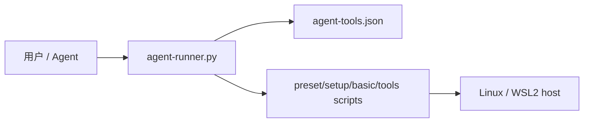
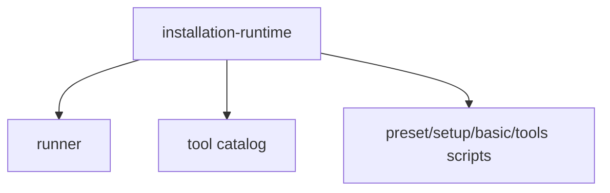

# installation-runtime

> 这个 domain 承载仓库最重要的运行边界：如何把“我要安装/检查某个环境能力”翻译成 runner 可调度、脚本可执行、结果可验证的动作。这里的核心不是某一个工具脚本，而是 runner、catalog 与脚本层的协作契约。

## 边界

- **包含**：`install-script/agent-runner.py`、`install-script/agent-tools.json`、`install-script/presets/`、`install-script/setup/`、`install-script/basic/`、`install-script/tools/`、与安装主路径直接相关的 README/docs。
- **不包含**：`nvim/` 详细编辑器配置、OpenHarmony 专用脚本的业务细节、个人化同步脚本。
- **主要证据**：`AGENTS.md`、`docs/agent-install-playbook.md`、`README-CN.md`、`install-script/agent-runner.py`、`install-script/agent-tools.json`

## 设计意图

这个 domain 存在，是因为仓库真正的长期复杂度在“安装编排与验收语义”，而不是在某一个 shell 文件本身。runner 要知道如何校验路径、如何读取 tool id、何时要求 sudo、如何记录日志、以及何时把“执行成功但验收失败”当成一个独立结果。

如果把这些事实散回 `basic/`、`setup/`、`tools/` 等源码目录去描述，后续维护者只会看到很多脚本，而看不到系统真正的契约边界。因此它需要单独成域。

## 设计约束

| 约束 | 为什么存在 | 违反后果 | 证据 / 来源 |
|---|---|---|---|
| 默认经 `python3 install-script/agent-runner.py` 执行 | 保证统一入口、参数验证、日志和验收 | agent 行为分叉，难以稳定复现 | AGENTS、playbook |
| `agent-tools.json` 是唯一工具目录 | tool id、脚本路径、前置条件和 `check_cmd` 要一致维护 | 文档与执行漂移 | AGENTS、README、catalog |
| 仓库路径固定为 `~/hpf_Linux_Config` | 许多脚本与 runner 明确依赖固定位置 | 路径错误时行为不可预测 | README、playbook |
| Ubuntu 24.04 换源走 `ubuntu.sources` | 发行版机制不同 | 会破坏 apt 源配置 | AGENTS、setup README |

## 取舍 / 被拒绝的简化

| 取舍或被拒绝的捷径 | 为什么有诱惑 | 为什么拒绝 / 限定边界 | 证据 / 决策 |
|---|---|---|---|
| 直接执行 shell 脚本 | 快、简单、少一层包装 | 会绕过 tool catalog 和 `check_cmd` 约束 | playbook、AGENTS |
| 让 README 列表承担工具目录真相 | 阅读方便 | 容易和代码分叉，且不可执行 | `agent-tools.json` 设计 |
| 把所有子目录都拆成独立 domains | 看起来更细 | 当前没有足够独立状态/契约，属于过度设计 | 当前架构拆分判断 |

## 未来 Agent 必须保持的内容

- `runner` 仍然是安装任务默认入口。
- `agent-tools.json` 中的 `tool id`、`script`、`check_cmd`、`requires_sudo`、`timeout` 保持为唯一 catalog。
- 修改 preset 或工具脚本后，要能回到 `check` 路径验证，而不是只看脚本输出。
- `github-auth` 单工具仍默认 `gh + HTTPS`；`bootstrap` / `all-tools` 是本仓库所有者的个人新机路径，检测到 `hpf` 账户时直接生成/上传 SSH key 并把 GitHub git protocol 切到 `ssh`，非 `hpf` 账户必须由 agent 先询问并通过 `HPF_BOOTSTRAP_CONFIRM_PERSONAL=yes` 与 `HPF_GIT_EMAIL` 显式确认。

## decomposition_basis

- **选择的拆分轴**: `single-level`
- **为什么选择此轴**: 当前最重要的状态/契约都仍围绕同一条安装运行主线，没有出现彼此独立的资源生命周期或协议边界。
- **被拒绝的拆分轴**:
  - `按目录 basic/setup/tools 拆`: 这是代码组织，不是架构边界。
  - `按 preset/setup/tool 类型拆`: 这些都受同一 runner/catalog 契约约束。
- **递归规则**: 只有当某个子树拥有独立状态所有权、外部契约或专门验证体系时再拆 child domain。
- **覆盖深度**: `deep`
- **覆盖范围**: runner、catalog、install-script 第一层目录、主安装文档。
- **证据摘要**: 所有长期约束都回指同一 runner/catalog 协议面。
- **图清单**: `INSTALL-RUNTIME-CTX-CURRENT`、`INSTALL-RUNTIME-FLOW-CHECK-CURRENT`
- **如果是 single-level**: 现在不需要 child domains，因为 `basic/setup/tools/presets` 仍共享同一执行协议；若未来 `nvim/` 或 `openharmony/` 发展出独立状态机，再触发拆分。
- **停止审查**: `self-reviewed` 对 `single-level` 返回 `no-more-required-changes`；全局 bootstrap reviewer 需最终挑战。
- **Reviewer 挑战**: 重点挑战是否需要把 `nvim` 或 OpenHarmony 立即独立成域。

## 设计单元

| 单元 | 职责 | Owner / 权威来源 | 备注 | 证据 |
|---|---|---|---|---|
| `agent-runner.py` | 统一解析 list/check/install/preset，校验路径/前置条件，执行脚本并验收；在 sudo 前拦截非 `hpf` 账户未确认的个人 bootstrap | 代码 + playbook | 域内主 orchestrator | verified |
| `agent-tools.json` | 维护 tool id、脚本路径、`check_cmd`、超时和 sudo/ssh 需求 | catalog 文件 | 域内唯一目录真相 | verified |
| `presets/` | 把常见安装组合组织成 bundle 入口 | preset docs + scripts | 组合层，不是独立架构域 | documented |
| `setup/` / `basic/` / `tools/` | 承载具体脚本实现 | 各脚本与 README | 实现层，由 runner 调度 | documented |

## Domain 一眼看懂 / Reader Map

| 子主题 | 读者问题 | 一句话答案 | 权威位置 | Evidence links | Why / 风险 / 约束 |
|---|---|---|---|---|---|
| Runtime flows | 一次安装/检查是怎么跑完的？ | runner 解析 catalog，执行脚本，再跑 `check_cmd`。 | [运行流](#运行流) | runner、catalog | 不要只看脚本 exit code。 |
| State / resources | 谁拥有目录真相和验收语义？ | `agent-tools.json` 拥有目录真相，runner 拥有执行/验收语义。 | [状态、数据与资源](#状态数据与资源) | catalog、runner | 双写会漂移。 |
| Contracts | 哪些边界不能破坏？ | 路径固定、catalog 单一、单工具 HTTPS 与个人 bootstrap SSH 的边界、24.04 换源规则。 | [跨边界契约](#跨边界契约) | AGENTS、playbook | 会直接影响真实机器环境。 |
| Failure / recovery | 常见失败如何检测和恢复？ | 看 runner 前置失败与 `check_cmd` 失败，再回到具体 setup/tool。 | [失败与恢复](#失败与恢复) | playbook | 失败类型要区分。 |

## 关键断言与证据

| Claim | Why / 风险 / 约束 | Owner / 小节 | Evidence links | 状态 |
|---|---|---|---|---|
| runner 是安装系统的编排 owner | 统一入口、日志和验收都在它这里 | [运行流](#运行流) | `agent-runner.py`、playbook | verified |
| `agent-tools.json` 是唯一目录与 `check_cmd` owner | 任何并行目录都会让 tool id 与 check 语义漂移 | [状态、数据与资源](#状态数据与资源) | AGENTS、catalog | verified |
| preset 只是组合入口，不是绕过 runner 的替代入口 | 保持统一协议面 | [设计单元](#设计单元) | preset docs | documented |

## 架构视角 / 图

### 图索引

| Diagram ID | 状态 | 覆盖内容 | 证据 |
|---|---|---|---|
| `INSTALL-RUNTIME-CTX-CURRENT` | current | domain 边界与外部 actor | README、playbook |
| `INSTALL-RUNTIME-FLOW-CHECK-CURRENT` | current | 安装/检查运行流 | runner、catalog |

### 当前边界 / 上下文

- **Diagram ID**: `INSTALL-RUNTIME-CTX-CURRENT`
- **状态**: `current`
- **覆盖内容**: 用户/agent、runner、catalog、脚本层和主机环境。
- **证据**: README、AGENTS、playbook



### 当前分解 / Domain

- **Diagram ID**: `INSTALL-RUNTIME-DECOMP-CURRENT`
- **状态**: `current`
- **覆盖内容**: single-level，内部只有职责分组，没有 child domains。
- **证据**: `install-script/` 顶层结构



### 当前运行流图

- **Diagram ID**: `INSTALL-RUNTIME-FLOW-CHECK-CURRENT`
- **状态**: `current`
- **覆盖内容**: list/check/install/preset 的统一执行与验收流。
- **证据**: playbook 对 runner 语义的说明、catalog 字段

```mermaid
sequenceDiagram
  participant Actor
  participant Runner
  participant Catalog
  participant Script
  participant Host
  Actor->>Runner: install/check/preset <id>
  Runner->>Catalog: validate tool id and metadata
  Runner->>Host: validate repo path / sudo if needed
  Runner->>Script: run target script
  Script->>Host: mutate environment
  Runner->>Host: run check_cmd
  Host-->>Runner: pass/fail
  Runner-->>Actor: success / exec-fail / check-fail
```

## 运行流

| Flow | Diagram ID | 路径 | 纳入原因 | 状态 / 资源所有权 | 证据 |
|---|---|---|---|---|---|
| 安装与验收主流 | `INSTALL-RUNTIME-FLOW-CHECK-CURRENT` | Actor → runner → catalog → script → check_cmd | 这是本仓库最核心的运行闭环 | runner 拥有执行顺序；catalog 拥有 tool metadata | verified |

## 状态、数据与资源

| 状态 / 数据 / 资源 | Diagram ID | Owner | 读取者 / 派生使用者 | 持久性 / 生命周期 | 证据 |
|---|---|---|---|---|---|
| 工具目录元数据 | `INSTALL-RUNTIME-CTX-CURRENT` | `agent-tools.json` | runner、agent、文档 | 仓库持久文件 | verified |
| 执行日志 | `INSTALL-RUNTIME-FLOW-CHECK-CURRENT` | runner | 用户/agent | 每次执行写入 `~/.local/share/hpf-linux-config/logs/` | documented |
| 目标机器环境状态 | `INSTALL-RUNTIME-FLOW-CHECK-CURRENT` | 主机环境 + 具体脚本 | `check_cmd` | 真实系统状态 | documented |
| 运行时 dotfiles | `INSTALL-RUNTIME-CTX-CURRENT` | `home/` | `bashrc`、`configs`、stow | 仓库持久文件，安装时链接到 `$HOME` | verified |

## 配置 / 可变性模型

| 可变性来源 | Diagram ID | 模式 / 值 | Owner / 权威来源 | 架构影响 | 证据 |
|---|---|---|---|---|---|
| Ubuntu 版本差异 | `INSTALL-RUNTIME-CTX-CURRENT` | 20.04 / 22.04 / 24.04 | playbook / setup docs | 影响换源与部分工具安装路径 | verified |
| GitHub 认证模式 | `INSTALL-RUNTIME-CTX-CURRENT` | `github-auth` 单工具默认 HTTPS；个人 `bootstrap` / `all-tools` 在 `hpf` 账户默认 SSH，非 `hpf` 账户需显式确认并提供 `HPF_GIT_EMAIL` | README / setup docs / catalog | 影响 bootstrap 流程与 git protocol | verified |
| 环境变量 `HPF_GIT_NAME` / `HPF_GIT_EMAIL` | `INSTALL-RUNTIME-FLOW-CHECK-CURRENT` | 可选输入 | `git-identity.sh` 文档 | 影响 Git 身份配置 | documented |

## 生命周期 / 并发 / 调度模型

| 生命周期 / scheduler | Diagram ID | Owner | 顺序 / 并发规则 | 失败 / shutdown 行为 | 证据 |
|---|---|---|---|---|---|
| 单次 runner 执行 | `INSTALL-RUNTIME-FLOW-CHECK-CURRENT` | runner | 先校验个人 bootstrap 确认与 sudo/ssh 前置，再执行脚本，最后验收 | 脚本失败直接返回；脚本成功但 check 失败返回验收失败 | playbook |

## 跨边界契约

| 契约 | Diagram ID | 边界 | 权威来源 | 兼容性规则 | 证据 |
|---|---|---|---|---|---|
| `tool id` / `script` / `check_cmd` 契约 | `INSTALL-RUNTIME-CTX-CURRENT` | agent ↔ runner ↔ catalog | `agent-tools.json` | 新工具必须补齐这些字段 | verified |
| 固定仓库路径契约 | `INSTALL-RUNTIME-CTX-CURRENT` | 仓库 ↔ runner / scripts | README、playbook | 改路径前必须同步修改 runner/script 假设 | verified |
| 个人 bootstrap SSH 契约 | `INSTALL-RUNTIME-CTX-CURRENT` | setup ↔ GitHub CLI ↔ GitHub | playbook、catalog、`bootstrap.sh` | 不要把 `bootstrap` 降级成纯 HTTPS；`hpf` 账户直接执行，非 `hpf` 账户需 agent 先问并设置确认变量与 `HPF_GIT_EMAIL` | verified |

## 不变量与约束

| 不变量 / 约束 | Diagram ID | 范围 | 违反后果 | 证据 |
|---|---|---|---|---|
| `check_cmd` 是最终状态裁判 | `INSTALL-RUNTIME-FLOW-CHECK-CURRENT` | 所有安装路径 | 误判环境已就绪 | verified |
| 非 `hpf` 账户不得静默执行个人 bootstrap | `INSTALL-RUNTIME-FLOW-CHECK-CURRENT` | `bootstrap` / `all-tools` | 在他人机器上上传 SSH key 或切换 GitHub protocol | verified |
| preset 验收必须覆盖成员工具 | `INSTALL-RUNTIME-FLOW-CHECK-CURRENT` | `minimal` / `dev-cli` / `dev-full` / `all-tools` | 抽查通过但实际工具缺失 | verified |
| 不凭 README 猜工具目录 | `INSTALL-RUNTIME-CTX-CURRENT` | 安装编排 | 入口与状态漂移 | verified |

## 失败与恢复

| 失败模式 | Diagram ID | 检测 | 恢复 / 降级 / 终止 | 证据 |
|---|---|---|---|---|
| 仓库路径不对 | `INSTALL-RUNTIME-CTX-CURRENT` | runner 校验失败 | 把仓库放回 `~/hpf_Linux_Config` | documented |
| sudo 前置不满足 | `INSTALL-RUNTIME-FLOW-CHECK-CURRENT` | `sudo -v` 失败 | 先解决权限 | documented |
| `gh auth` 未完成 | `INSTALL-RUNTIME-FLOW-CHECK-CURRENT` | `check_cmd` 失败 | 先跑 `github-auth` | verified |
| 非 `hpf` 账户未确认个人 bootstrap | `INSTALL-RUNTIME-FLOW-CHECK-CURRENT` | `bootstrap.sh` 前置检查失败 | agent 先问用户，获准后传入 `HPF_BOOTSTRAP_CONFIRM_PERSONAL=yes` 和 `HPF_GIT_EMAIL` | verified |
| bootstrap SSH 未完成 | `INSTALL-RUNTIME-FLOW-CHECK-CURRENT` | `preset-bootstrap` / `github-ssh` 的 `check_cmd` 失败 | 重新运行 `github-ssh` 或检查 `gh auth` scope / SSH key 上传 | verified |
| dotfiles 链接缺失或指向旧路径 | `INSTALL-RUNTIME-FLOW-CHECK-CURRENT` | `bashrc` / `configs` 的 `check_cmd` 失败 | 重新运行对应 tool，确认链接指向 `home/` 下权威文件 | verified |
| 脚本成功但 check 失败 | `INSTALL-RUNTIME-FLOW-CHECK-CURRENT` | runner 返回验收失败 | 回到具体脚本与风险项排查 | documented |

## 验证

| Claim | 验证命令 / 来源 | 证据指针 | 频率 / 触发条件 |
|---|---|---|---|
| runner 能列出完整 catalog | `python3 install-script/agent-runner.py list` | CLI 输出 | 修改 catalog 后 |
| 安装状态以 `check_cmd` 判定 | `python3 install-script/agent-runner.py check <tool>` | playbook + 运行行为 | 修改脚本或工具后 |
| preset 状态按成员工具汇总 | `python3 install-script/presets/check-preset.py <preset>` | catalog + helper script | 修改 preset 成员或 check 语义后 |
| 主目录结构符合 domain 叙述 | `find install-script -maxdepth 2 -type d` | 目录树 | 结构性改动后 |

## 当前 / 目标 / 差距

| 区域 | Current | Target | Gap / 下一步验证 | 证据 / 来源 |
|---|---|---|---|---|
| 编排主轴 | runner + catalog 已稳定 | 保持这条主轴 | 无阻塞 gap | verified |
| 子域拆分 | 仍单层 | 出现独立状态边界时再拆分 | `nvim/` 是否升格待未来观察 | inferred |
| 验证体系 | 以 `check_cmd` 为主 | 继续保持、必要时补更细测试 | 没有统一 CI 证据 | verified |

## 演进 / 迁移台账

| 演进线 | 旧形态 | Current / target 替代方案 | 兼容状态 | 不要复活的概念 | 对 Current / Target / Gap 的影响 | 证据 / 决策 |
|---|---|---|---|---|---|---|
| 安装入口迁移 | 历史 direct scripts / 旧 TUI 心智 | runner-first + catalog-first | active | 直接把脚本目录当主入口 | 这是当前架构主干 | README、playbook、AGENTS |

## 子 Domains

No child domains。当前 single-level 的停止理由见 `decomposition_basis`；若 `nvim/`、OpenHarmony 或发布治理发展出独立状态机，再重新拆分。
